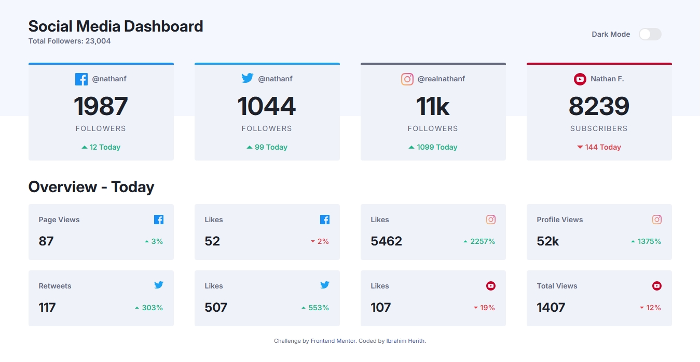

# Frontend Mentor - Social media dashboard with theme switcher solution

This is a solution to the [Social media dashboard with theme switcher challenge on Frontend Mentor](https://www.frontendmentor.io/challenges/social-media-dashboard-with-theme-switcher-6oY8ozp_H). Frontend Mentor challenges help you improve your coding skills by building realistic projects.

## Table of contents

- [Overview](#overview)
  - [The challenge](#the-challenge)
  - [Screenshot](#screenshot)
  - [Links](#links)
- [My process](#my-process)
  - [Built with](#built-with)
  - [What I learned](#what-i-learned)
  - [Continued development](#continued-development)
- [Author](#author)

**Note: Delete this note and update the table of contents based on what sections you keep.**

## Overview

### The challenge

Users should be able to:

- View the optimal layout for the site depending on their device's screen size
- See hover states for all interactive elements on the page
- Toggle color theme to their preference

### Screenshot




### Links

- Solution URL: [Add solution URL here](https://your-solution-url.com)
- Live Site URL: [Add live site URL here](https://your-live-site-url.com)

## My process

### Built with

- Mobile-first approach
- Semantic HTML5 markup
- Tailwind CSS
- JavaScript

### What I learned

- How to implement dark mode using tailwindcss and javascript
- How to use gradients in tailwindcss

```html
<label class="inline-flex items-center me-5 cursor-pointer">
  <input type="checkbox" value="" id="toggle-button" class="sr-only peer" />
  <div
    class="relative w-11 h-6 bg-gray-200 rounded-full peer dark:bg-gray-700 peer-checked:after:translate-x-full rtl:peer-checked:after:-translate-x-full peer-checked:after:border-white after:content-[''] after:absolute after:top-0.5 after:start-[2px] after:bg-white after:rounded-full after:h-5 after:w-5 after:transition-all dark:after:bg-DarkDesaturatedBlue dark:border-gray-600 peer-checked:bg-Red dark:peer-checked:bg-linear-to-r/hsl from-ToggleDark1 to-ToggleDark2"
  ></div>
</label>
```

```js
const toggleCheckbox = document.getElementById("toggle-button");
const htmlElement = document.documentElement;

// Check localStorage for theme preference
if (localStorage.getItem("theme") === "dark") {
  htmlElement.classList.add("dark");
  toggleCheckbox.checked = true;
}

toggleCheckbox.addEventListener("change", () => {
  if (toggleCheckbox.checked) {
    htmlElement.classList.add("dark");
    localStorage.setItem("theme", "dark");
  } else {
    htmlElement.classList.remove("dark");
    localStorage.setItem("theme", "light");
  }
});
```

### Continued development

To learn and practice more about tailwindcss and use it in projects.

## Author

- Website - [Ibrahim Herith](https://itsibrah.netlify.app/)
- Frontend Mentor - [@ibrahimherith](https://www.frontendmentor.io/profile/ibrahimherith)
- Twitter - [@itsibrah](https://www.twitter.com/itsibrah)
